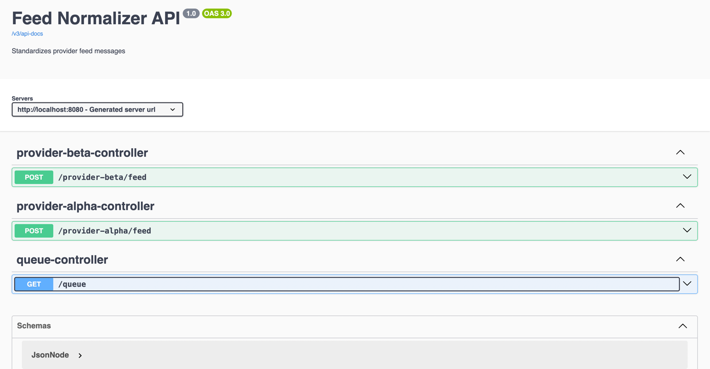

# feed-ingestion
This service is responsible for feeds contain critical information such as odds updates and event settlements for live sports events and right now it will consume feed from two different feed provider => provider-beta/provider-alpha

## 📦 Features

- 🧾 Accepts `ODDS_CHANGE` and `BET_SETTLEMENT` events from ProviderAlpha and ProviderBeta
- 🔄 Converts proprietary formats into a standardized structure
- 🧪 Publishes to a mock in-memory message queue
- 📘 Swagger UI for interactive API docs

---

## 🛠️ Tech Stack

- Java 21
- Spring Boot 3.5.3
- Gradle Build Tool
- OpenApi (Swagger UI)
- In-memory mock queue

---

## 🚀 Getting Started

### ✅ Prerequisites

- Java 21+
- Gradle 8.x (or use wrapper)

---

### ⚙️ Run with Gradle

```bash
# Clone the repository
git clone git@github.com:rajatpal96/feed-ingestion.git

cd feed-ingestion
# Run the application
./gradlew bootRun

| Provider       | Endpoint               | Method |
| -------------- | ---------------------- | ------ |
| Provider Alpha | `/provider-alpha/feed` | POST   |
| Provider Beta  | `/provider-beta/feed`  | POST   |
```

🔍 Swagger UI
Access Swagger docs at:
http://localhost:8080/swagger-ui.html
***************************************************************
****To retrieve in-memory queued data we can use this endpoint
=> http://localhost:8080/queue****




👤 Author – @RajatKumar


